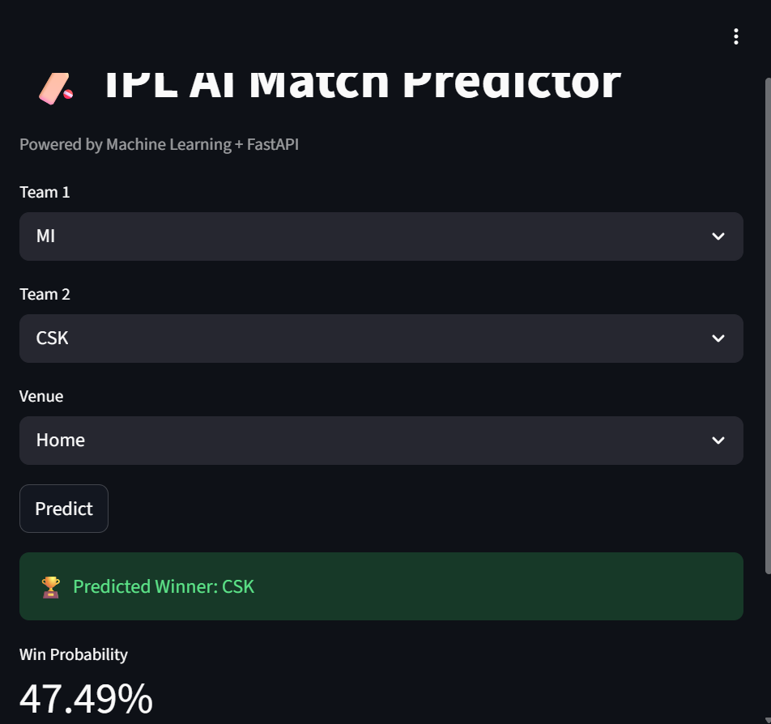

# 🏏 IPL Match Predictor

<p align="center">
  <b>End-to-End Machine Learning System</b><br>
  FastAPI • Streamlit • Docker • ML
</p>


## ✨ Overview

This project demonstrates how to take a machine learning model beyond a notebook and turn it into a **deployable system**.

It includes:

* API for serving predictions
* UI for user interaction
* Docker-based deployment


## 🚀 Features

* Predict match winner
* Show win probability
* FastAPI backend
* Streamlit UI
* Dockerized setup
* External API integration


## 🧠 Architecture

```
User → Streamlit → FastAPI → ML Model → Output
```


## 📸 Demo




## ⚙️ Run with Docker

```
docker-compose up --build
```

Open:

* http://localhost:8501
* http://localhost:8000/docs


## 💻 Run Locally

```
pip install -r requirements.txt
uvicorn main:app --reload
streamlit run app.py
```


## 📁 Structure

```
app.py
main.py
model.py
data.csv
Dockerfile.api
Dockerfile.ui
docker-compose.yml
requirements.txt
```


## 📌 Learnings

* API development for ML
* Frontend-backend integration
* Docker containerization
* Debugging real systems


## 👨‍💻 Author

Ashutosh
B.Tech CS


